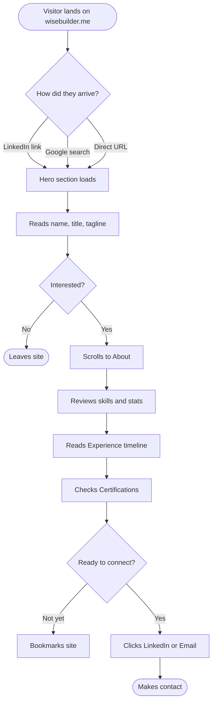
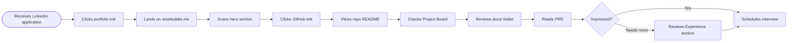
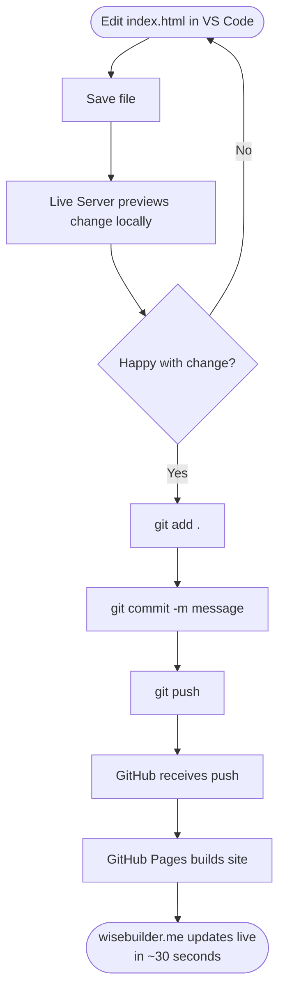
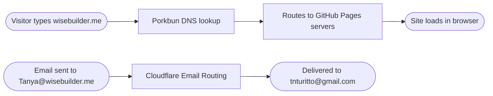

# User Journey Flowcharts
**Project:** Wise Builder Resume Portfolio Site  
**Author:** Tanya Turitto  
**Last Updated:** March 2026  

---

## 1. Visitor Journey — First Time User


---

## 2. Hiring Manager Journey


---

## 3. Site Build & Deploy Flow


---

## 4. Domain & Email Routing Flow


---

## 5. Future Platform Architecture
```mermaid
flowchart TD
    A([wisebuilder.me]) --> B[/ — Resume Portfolio]
    A --> C[/gift-helper — Project 2]
    A --> D[/project-3 — TBD]
    A --> E[/project-4 — TBD]
    
    B --> F[docs/PRD.md]
    B --> G[docs/FLOWCHART.md]
    B --> H[docs/INFRA-TOOLING.md]
    B --> I[docs/RETROSPECTIVE.md]
    
    C --> J[docs/PRD.md]
    C --> K[docs/FLOWCHART.md]
```

---

*This document is part of the Wise Builder AI PM Portfolio  
by Tanya Turitto · wisebuilder.me · Tanya@wisebuilder.me*
